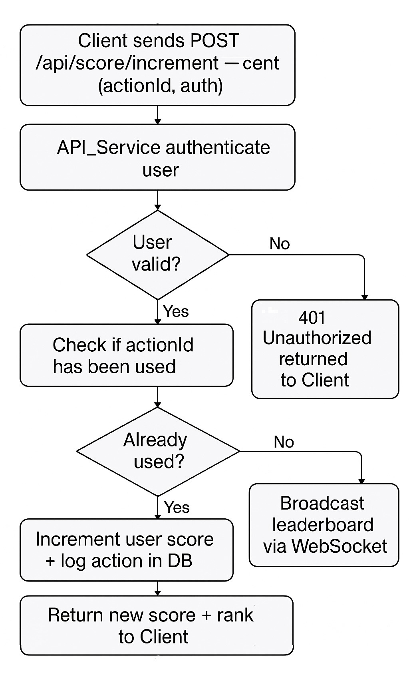
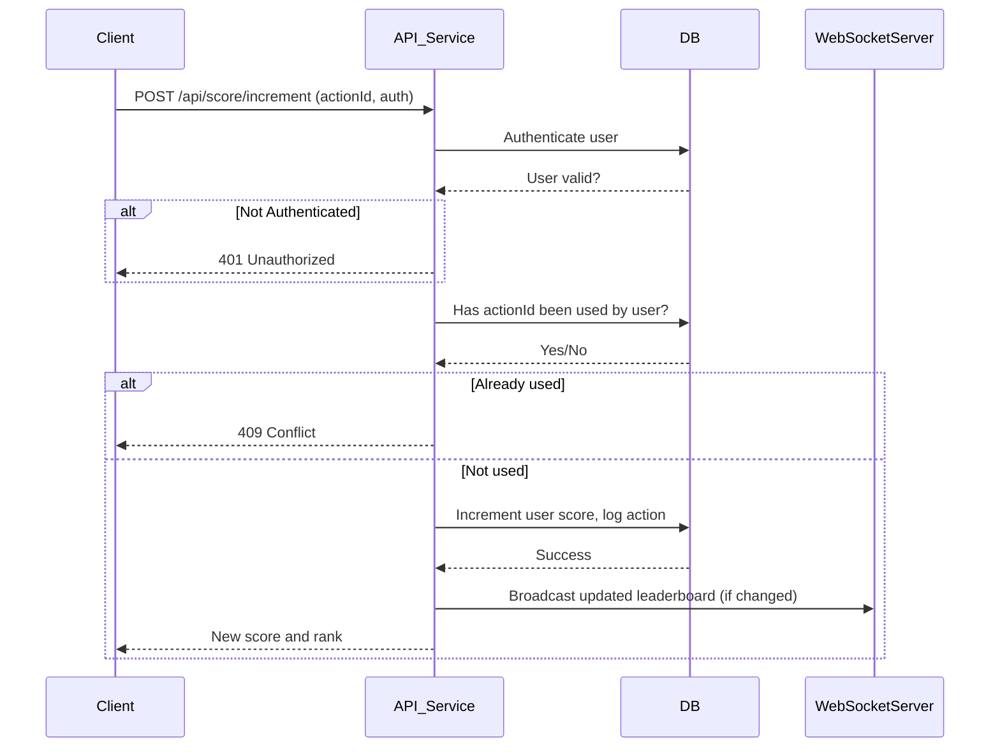

# Backend Code Challenge

This repository contains three backend modules:

- **Problem 4:** Summation to N in TypeScript
- **Problem 5:** Express TypeScript CRUD API for managing items
- **Problem 6:** Live Scoreboard API Module for real-time user score updates

---

## Table of Contents

1. [Problem 4: Summation to N in TypeScript](#Problem 4: Summation to N in TypeScript)
   - [Features](#features)
   - [Prerequisites](#prerequisites)
   - [Getting Started](#getting-started)
   - [API Endpoints](#api-endpoints)
   - [Customization](#customization)
2. [Problem 5: Express TypeScript CRUD API](#problem-5-express-typescript-crud-api)
   - [Features](#features)
   - [Prerequisites](#prerequisites)
   - [Getting Started](#getting-started)
   - [API Endpoints](#api-endpoints)
   - [Customization](#customization)
3. [Problem 6: Live Scoreboard API Module](#problem-6-live-scoreboard-api-module)
   - [Overview](#overview)
   - [API Endpoints](#api-endpoints-1)
   - [Security & Anti-Cheating](#security--anti-cheating)
   - [Execution Flow Diagram](#execution-flow-diagram)
   - [Areas for Improvement](#areas-for-improvement)

---
# Problem 4: Summation to N in TypeScript

Implements three unique TypeScript functions to compute the sum of all integers from 1 up to a given positive integer n (i.e., 1 + 2 + ... + n).

### Function Signature
```typescript
function sum_to_n(n: number): number
```

### Implementations
- **Iterative Approach:** Uses a for-loop (O(n) time, O(1) space)
- **Mathematical Formula:** Uses arithmetic series formula (O(1) time, O(1) space)
- **Recursive Approach:** Uses recursion (O(n) time, O(n) space)

### Usage Example
```typescript
console.log(sum_to_n_a(5)); // Output: 15
console.log(sum_to_n_b(5)); // Output: 15
console.log(sum_to_n_c(5)); // Output: 15
```


---

# Problem 5: Express TypeScript CRUD API

A simple backend server using Express, TypeScript and SQLite (via Prisma ORM) to provide a CRUD API for managing "items".

## Features

- **Create** a resource (item)
- **List** resources with basic (name) filtering
- **Read** details of a resource
- **Update** a resource
- **Delete** a resource
- Typed with TypeScript
- SQLite for easy persistence

## Prerequisites

- Node.js (v16 or higher recommended)
- npm

## Getting Started

### 1. Clone & Install

```sh
cd problem-5
npm install
```

### 2. Setup Database (SQLite)

First, generate the Prisma client and set up your SQLite database:

```sh
npx prisma generate
npx prisma migrate dev --name init
```

This creates the initial database and tables.

### 3. Run the Server

For live-reloading (development):

```sh
npm run dev
```

For compiled production:

```sh
npm run build
npm start
```

By default, the server runs at http://localhost:3000

### 4. API Endpoints

**Base path:** `/items`

#### Create

- `POST /items`
   - Body: `{ "name": "Your item name" }`
```sh
curl -X POST http://localhost:3000/items -H "Content-Type: application/json" -d '{"name":"First thing"}'
```

#### List (with optional `?name=foo` filter)

- `GET /items`
- `GET /items?name=foo`
- Supports `?skip=0&take=20` pagination

```sh
curl "http://localhost:3000/items"
curl "http://localhost:3000/items?name=First%20thing"
```

#### Retrieve

- `GET /items/:id`

```sh
curl "http://localhost:3000/items/1"
```

#### Update

- `PUT /items/:id`
   - Body: `{ "name": "New name" }`
```sh
curl -X PUT http://localhost:3000/items/1 -H "Content-Type: application/json" -d '{"name":"Updated name"}'
```

#### Delete

- `DELETE /items/:id`

```sh
curl -X DELETE http://localhost:3000/items/1
```

### 5. Example Request

```sh
curl -X POST http://localhost:3000/items -H "Content-Type: application/json" \
  -d '{"name":"First thing"}'
```

## Customization

- Edit `prisma/schema.prisma` to add more fields to the Item model.
- Run `npx prisma migrate dev --name describe-change` after modifying the schema.

---

# Problem 6: Live Scoreboard API Module

## Overview

This module enables real-time user score updates for the website scoreboard. Users can increase their score through specific actions, and the top 10 leaderboard is kept live and accurate for all viewers.

## API Endpoints

### 1. Increment User Score

**POST `/api/score/increment`**

- **Headers:**  
  `Authorization: Bearer <token>`

- **Body:**
  ```json
  {
    "actionId": "string"
  }
  ```

- **Success Response:**
   - Status: 200 OK
   - Body:
     ```json
     {
       "score": 123,
       "rank": 4
     }
     ```
- **Errors:**
   - 401: Unauthorized
   - 409: Conflict (action already recorded)

### 2. Get Top Scores

**GET `/api/score/top`**

- **Headers:**  
  `Authorization: Bearer <token>` (optional for public display)
- **Response:**
  ```json
  {
    "topScores": [
      {"username": "user1", "score": 150},
      ...
    ],
    "yourScore": 123,
    "yourRank": 7
  }
  ```

### 3. Real-time Updates (WebSocket)

**Endpoint:** `/ws/scoreboard`

- On connection: authenticate via token.
- On leaderboard update:
  ```json
  {
    "topScores": [
      {"username": "user1", "score": 150},
      ...
    ]
  }
  ```

## Security & Anti-Cheating

- All score increments require a valid logged-in user.
- Each actionId may only increment a given user’s score once.
- All endpoints are rate-limited.
- All score changes are audit logged.

## Execution Flow Diagram





## Areas for Improvement

- Consider using signed, time-limited action tokens to further reduce replayability.
- Add monitoring for suspicious activity (e.g., too many score increments in a short period).
- Support for separate leaderboards per game or category.
- Provide pagination for full leaderboard beyond top 10.
- Consider implementing exponential backoff on rate-limits.
- Add per-user and per-action type restrictions for more granularity.
- Optionally, use message queues for decoupling WebSocket broadcasts to improve scalability.
