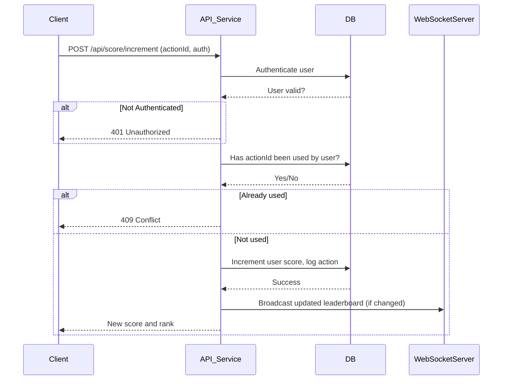

# Live Scoreboard API Module

## Overview

This module enables real-time user score updates for the website scoreboard. Users can increase their score through specific actions, and the top 10 leaderboard is kept live and accurate for all viewers.

## API Endpoints

### 1. Increment User Score

**POST `/api/score/increment`**

- **Headers:**  
  `Authorization: Bearer <token>`

- **Body:**
  ```json
  {
    "actionId": "string"
  }
  ```

- **Success Response:**
    - Status: 200 OK
    - Body:
      ```json
      {
        "score": 123,
        "rank": 4
      }
      ```
- **Errors:**
    - 401: Unauthorized
    - 409: Conflict (action already recorded)

### 2. Get Top Scores

**GET `/api/score/top`**

- **Headers:**  
  `Authorization: Bearer <token>` (optional for public display)
- **Response:**
  ```json
  {
    "topScores": [
      {"username": "user1", "score": 150},
      ...
    ],
    "yourScore": 123,
    "yourRank": 7
  }
  ```

### 3. Real-time Updates (WebSocket)

**Endpoint:** `/ws/scoreboard`

- On connection: authenticate via token.
- On leaderboard update:
  ```json
  {
    "topScores": [
      {"username": "user1", "score": 150},
      ...
    ]
  }
  ```

## Security & Anti-Cheating

- All score increments require a valid logged-in user.
- Each actionId may only increment a given user’s score once.
- All endpoints are rate-limited.
- All score changes are audit logged.

## Execution Flow Diagram




## Areas for Improvement

- Consider using signed, time-limited action tokens to further reduce replayability.
- Add monitoring for suspicious activity (e.g., too many score increments in a short period).
- Support for separate leaderboards per game or category.
- Provide pagination for full leaderboard beyond top 10.
- Consider implementing exponential backoff on rate-limits.
- Add per-user and per-action type restrictions for more granularity.
- Optionally, use message queues for decoupling WebSocket broadcasts to improve scalability.
